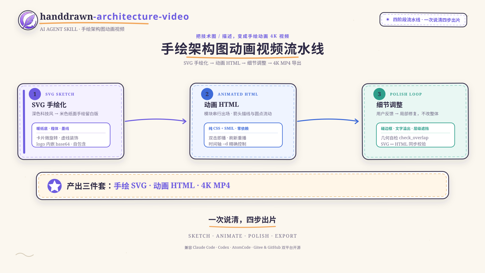
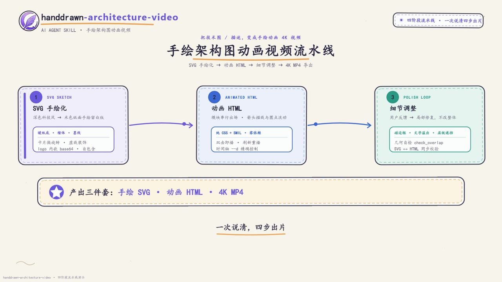
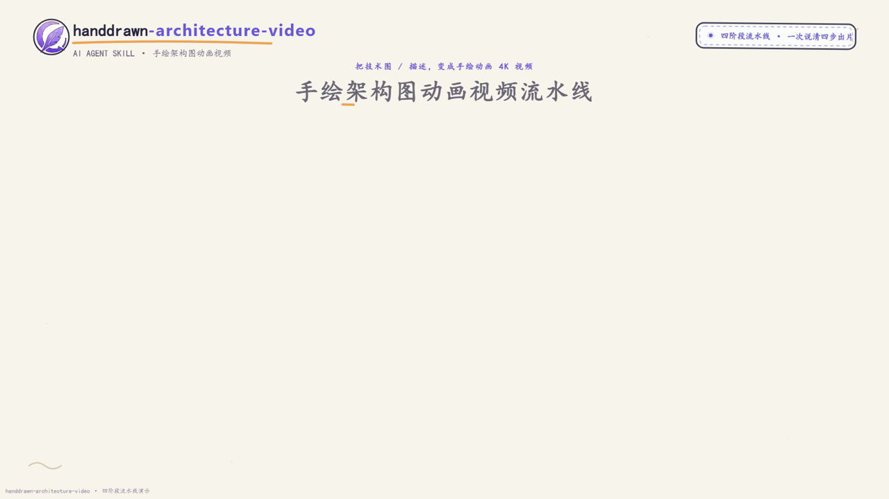

<div align="center">


# Handdrawn Architecture Video

**把技术图变成「手绘动画 4K 视频」的 AI Agent Skill**

纯本地运行 · 零云端依赖 · 双击即播 · 一次说清，四步出片

`SVG 手绘化 → 动画 HTML → 细节调整 → 4K MP4 导出`

[](LICENSE)
[](SKILL.md)


</div>

---

> 📌 **项目背景**：本 skill 诞生于 **2026 vivo AIGC 创作大赛 · 墨塑团队** 参赛项目（墨塑 Morpheus —— AI 叙事创作平台），将比赛视频素材「架构图 / 创新卡 → 手绘动画 → 4K 成片」的全流程生产实践，沉淀为一套可复用的开源能力。

## ✨ 这是什么

一个开箱即用的 **AI 技能包**：只要把一张技术图（或一段描述）交给 Agent，它就会按固定流水线帮你产出一套比赛 / 路演 / 产品演示级素材：

| 输入 | 输出 |
|---|---|
| 深色 / 科技风 SVG 架构图 | ✅ 米色纸面**手绘风格** SVG（logo 自包含内嵌） |
| 一段描述 / Markdown 文档（阶段 0） | ✅ 自包含**动画 HTML**（纯 CSS + SMIL，双击即播） |
| 一句话需求 | ✅ **3840×2160 4K MP4**（H.264 / bt709 / 高帧率流畅） |

> 手绘风格：暖纸底 `#FBF7EF` · 楷体 · 卡片微旋转 · 墨线描边 · 手绘箭头 · 圆点流动动画 —— 全程统一，观感友好。

## 🎬 效果展示

下面是**本 skill 自己产出**的完整演示（手绘 SVG → 动画 HTML → 4K MP4 三件套，即本文档开篇图的制作过程）：

### 动画演示（GIF，自动播放）


### 手绘作品（SVG 直接渲染）



### 4K 视频帧（3840×2160）



### 4K 视频演示（点击播放）

[](examples/preview/skill_pipeline_4K.mp4)

> 💡 演示素材均可直接在 `examples/preview/` 查看：`skill_pipeline.svg`（手绘源）、`skill_pipeline.html`（动画源，双击即播）、`skill_pipeline_4K.mp4`（4K 成片）。

## 🎯 特性

- **四阶段流水线**：SVG 手绘化 → 动画 HTML → 细节调整 → 4K 导出，每阶段独立可交付
- **零依赖自包含**：动画 HTML 纯 CSS + SMIL，无 CDN / 无外部库，双击即播、刷新重播
- **高帧率导出**：1080p CDP screencast + lanczos 放大 4K（实测 ~24–50fps，PSNR 46.9dB 与原生 4K 几乎无差异）
- **真实时间驱动**：SMIL 圆点流动动画按真实时间采集，不丢帧
- **一键脚本**：单命令完成「装依赖 → 采集 → 合成 → 验证 → 清理」
- **自动自检**：`selfcheck.py` 一键检查结构 / frontmatter / 脚本语法 / HTML 坑；`check_overlap.py` 自动查文字超框、卡片重叠
- **多平台**：Windows（PowerShell）/ macOS / Linux（bash）全覆盖
- **踩坑固化**：CSS transform 覆盖、dasharray 周长、fill-opacity、PS BOM、反斜杠……全部写成规范 + 自动检测

## 🚀 快速开始

### 1. 安装

把 `handdrawn-architecture-video/` 目录放入 Agent 的 skills 路径：

| Agent | 路径 |
|---|---|
| Claude Code | `~/.claude/skills/handdrawn-architecture-video/` |
| Codex | `~/.codex/skills/handdrawn-architecture-video/` |
| AtomCode | `~/.atomcode/skills/handdrawn-architecture-video/` |

或从 Gitee 克隆后拷贝：

```bash
git clone https://gitee.com/xie-linfeng-666/handdrawn-architecture-video.git
```

### 2. 唤醒（两种方式任选）

**① 自动匹配** —— 直接提出需求，Agent 会自动命中本 skill：

> 「把 `架构图_深色版.svg` 重绘为手绘风格，生成动画 HTML（模块依次出现、箭头有动画），再导出 4K MP4。」
>
> 「从这段产品描述生成一张手绘架构图动画视频。」
>
> 「做一张创新卡片的比赛视频素材。」

**② 显式点名** —— 确保调用：

> 「用 **handdrawn-architecture-video** 处理这个 SVG，走完整流程。」

### 3. 自检安装是否成功

```bash
cd handdrawn-architecture-video
python scripts/selfcheck.py .
```

看到 `OK selfcheck 全部通过` 即安装成功。

## 🎬 实际效果

本 skill 已在墨塑项目（45 秒比赛视频）中完整实战，产出 15+ 个 4K 素材：

- 系统架构图（16s / 12s 快节奏两版）
- 三张创新卡：蓝图＋记忆、VibeWorking、多角色智能配音闭环
- 行业现状与内容创作赛道趋势（柱状图生长动画）
- 应用场景与产业价值（四面板 + 产业数据卡）
- 三大创新总结、价值总结系列

每个素材：手绘 SVG + 动画 HTML + 4K MP4 三件套，全部用本流水线产出。

## 📚 文档

| 文档 | 内容 |
|---|---|
| [SKILL.md](SKILL.md) | Agent 工作流入口：四阶段 + 阶段 0（描述生成）+ 验收清单 + FAQ |
| [references/handdrawn-style.md](references/handdrawn-style.md) | 手绘设计令牌：配色 / 字体 / 描边 / 箭头 / 布局骨架 |
| [references/animation-html.md](references/animation-html.md) | 动画基元 / 串行时序 / 箭头动画 / 六大踩坑清单 |
| [references/from-description.md](references/from-description.md) | 阶段 0：描述 / MD → 元素分组 → 布局模板 |
| [references/export-4k.md](references/export-4k.md) | 4K 导出：screencast / lanczos / 色彩 / 帧率实测对比 |
| [examples/](examples/) | 最小自包含样板（克隆即可打开）+ 墨塑实战样例清单 |

## 📂 目录结构

```
handdrawn-architecture-video/
├── SKILL.md                 # Skill 入口：四阶段工作流 + 验收清单 + FAQ
├── README.md                # 本文件
├── LICENSE                  # MIT
├── CONTRIBUTING.md          # 贡献指南
├── SECURITY.md              # 安全策略
├── CODE_OF_CONDUCT.md       # 行为准则
├── .github/workflows/ci.yml # CI：自动跑 selfcheck
├── references/              # 五份规范文档（手绘/动画/阶段0/导出）
├── scripts/
│   ├── capture.js           # 1080p CDP screencast 高帧率采集
│   ├── make_concat.py       # 按真实时间戳生成 concat（自动识别 png/jpg）
│   ├── batch_export.py      # 多素材批量导出
│   ├── export_4k.ps1/.sh    # 一键导出（Windows / 跨平台）
│   ├── embed_logo.py        # logo → base64 内嵌
│   ├── compress_timeline.py # 时间轴 ×scale 压缩（12s 版）
│   ├── verify_animation.py  # 动画 HTML 验收自检
│   ├── verify_sync.py       # SVG ↔ HTML 同步校验
│   ├── check_overlap.py     # 文字超框 / 卡片重叠几何检查
│   └── selfcheck.py         # 发布前一键自检
└── examples/                # minimal-demo.html 样板 + 实战样例清单
```

## ⚡ 一键导出（不依赖 Agent 也可用）

```powershell
# Windows
.\scripts\export_4k.ps1 -Html "..\架构图_动画.html" -Out "架构图_4K.mp4" -DurationMs 14000
```

```bash
# macOS / Linux
./scripts/export_4k.sh ../架构图_动画.html 架构图_4K.mp4 14000
```

环境变量可覆盖：`MOSU_CHROME` / `MOSU_NPM_PROXY` / `MOSU_WIDTH` / `MOSU_HEIGHT` / `MOSU_DURATION_MS`。

## ❓ FAQ

| 问题 | 一句话解法 |
|---|---|
| 导出视频一卡一卡 | 逐帧 screenshot 仅 ~4.8fps → 改 1080p CDP screencast + lanczos 放大（~24fps+） |
| MP4 背景发白 | JPEG 帧需 `scale=in_range=full:out_range=tv` + bt709/tv 元数据 |
| 元素堆左上角 / 错位 | keyframes 禁用 `transform:`，只用独立 `translate` 属性 |
| 文字被不透明色块遮挡 | 半透明底色用 `fill-opacity`，不要 `opacity` |
| 文字超框 / 卡片重叠 | `python scripts/check_overlap.py <html> [--cards]` |
| PowerShell 解析报错 | ps1 需 UTF-8 BOM，勿用 PS7 `??` 运算符 |
| heredoc 后 node SyntaxError | `HTML.replace(/\\/g,'/')` 反斜杠被吃 → 用 edit_file 写入 |

## 🤝 贡献

欢迎提交 PR 或 Issue！请先阅读 [CONTRIBUTING.md](CONTRIBUTING.md)，提交前务必通过：

```bash
python scripts/selfcheck.py .
```

## 📄 License

[MIT](LICENSE) © handdrawn-architecture-video contributors
